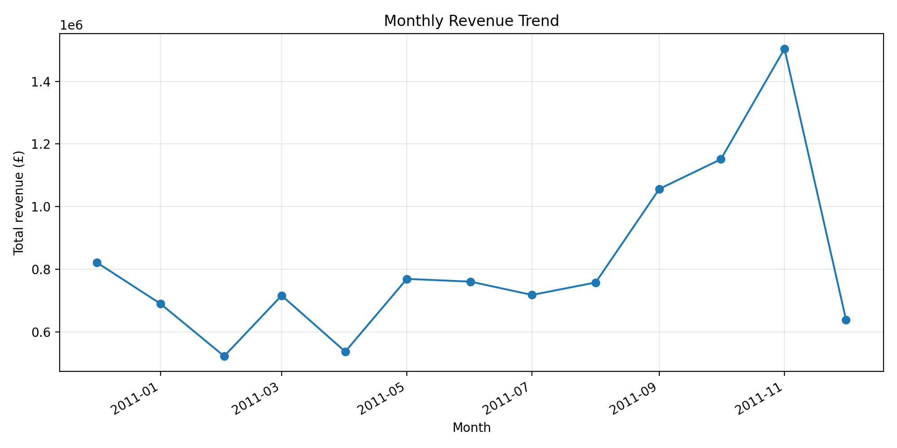
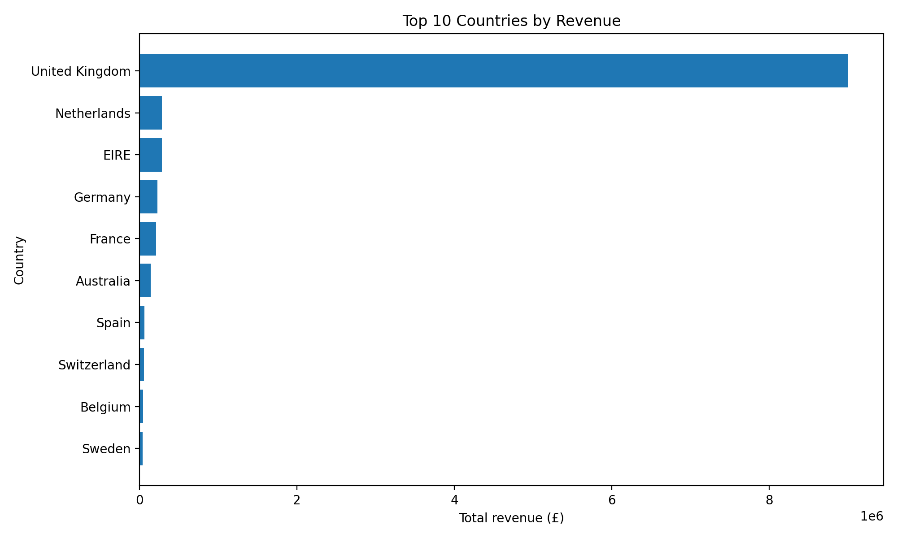
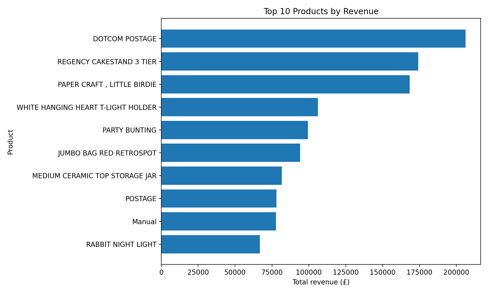
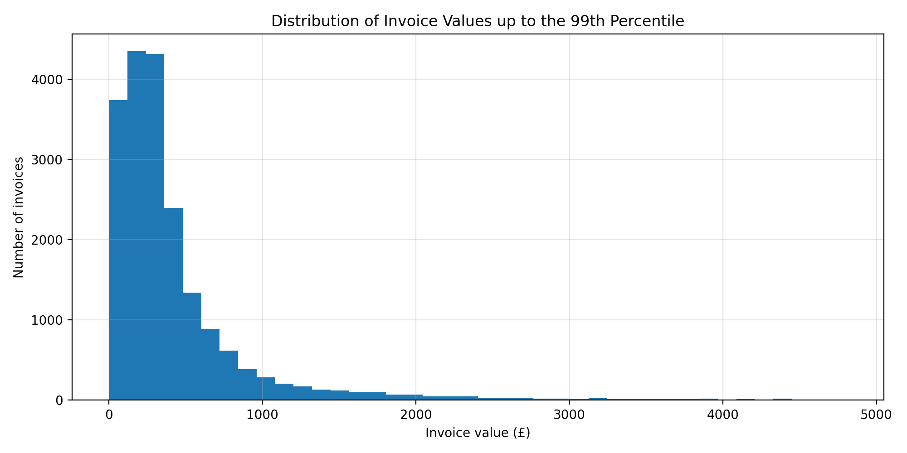
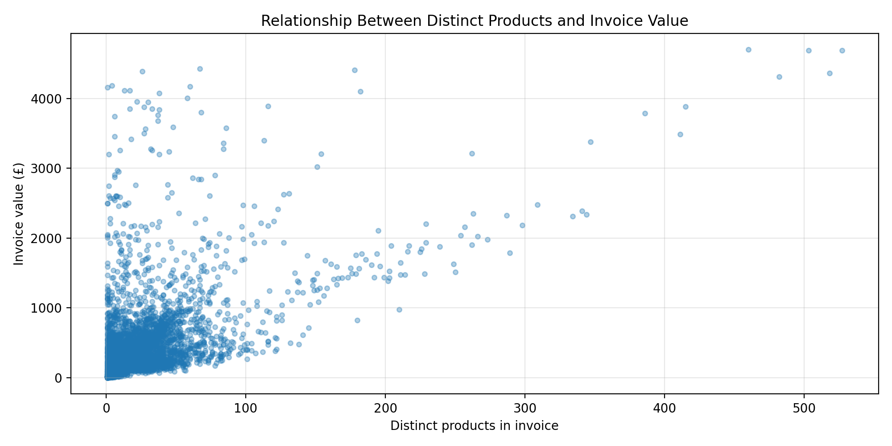
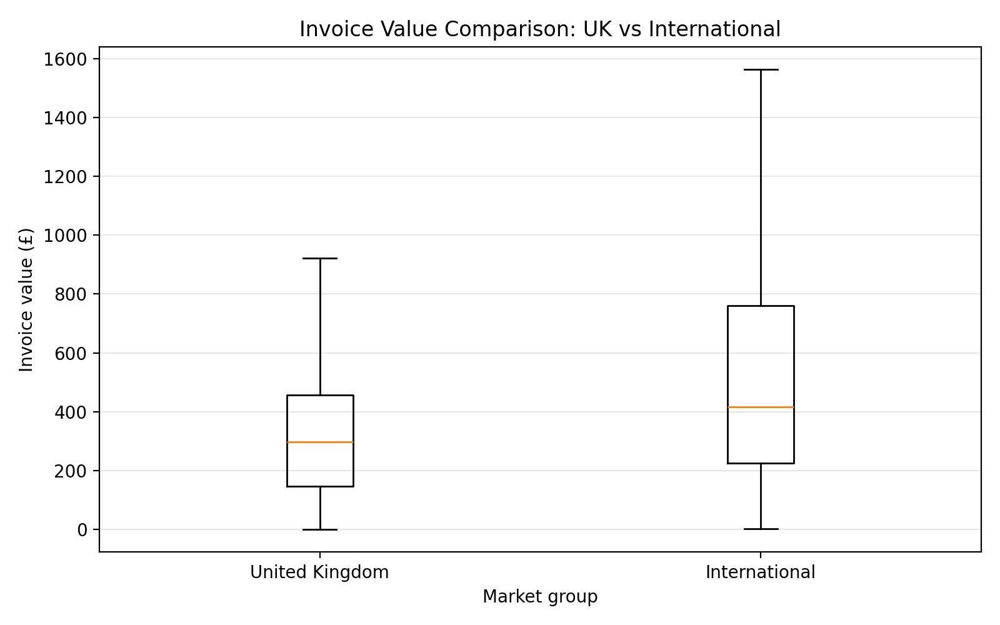

# Customer Purchase Behavior and Revenue Trends in Online Retail Transactions

**Student name:** Your Name

**Student ID:** Your Student ID

**Dataset:** Online Retail

**Dataset source page:** https://archive.ics.uci.edu/dataset/352/online+retail

**Direct dataset file:** https://archive.ics.uci.edu/ml/machine-learning-databases/00352/Online%20Retail.xlsx

**Citation:** Chen, D. (2015). Online Retail [Dataset]. UCI Machine Learning Repository. https://doi.org/10.24432/C5BW33

---

## 1. Project objective

The objective of this project is to analyze customer purchase behavior and revenue trends using a real online retail transaction dataset. The analysis focuses on how revenue changes over time, which countries and products contribute most to sales, how customers purchase, and which transactions are unusually large.

## 2. Analytical questions

1. How does online retail revenue change over time?
2. Which countries and products contribute most to total revenue?
3. What patterns exist in customer purchase behavior, and which transactions look unusually large?

These questions matter because an online retailer can use them to understand seasonality, identify important markets and products, improve customer strategy, and detect unusually large purchases that may need special attention.

## 3. Dataset description and understanding

The raw dataset contains **541,909 rows** and **8 columns**. The analysis-ready sales dataset contains **524,878 rows** after cleaning. The transaction period in the cleaned data is from **2010-12-01** to **2011-12-09**.

The dataset includes invoice number, product code, product description, quantity, invoice date, unit price, customer ID, and customer country. This structure is suitable for revenue analysis, product ranking, customer-level summaries, country comparison, time trend analysis, and outlier detection.

Important data-understanding outputs were exported into the `outputs/tables/` folder:

- `data_types_and_missing_values.csv`
- `sample_rows.csv`
- `numeric_summary_statistics.csv`

## 4. Data cleaning and preparation

The following cleaning steps were applied:

- **Standardized column names:** Lowercase snake_case names are easier and safer to use in Python code.
- **Converted data types:** Dates and numeric fields must have correct types before time-series and revenue calculations.
- **Removed exact duplicate rows:** Duplicates can overstate sales revenue and transaction counts.
- **Separated cancelled/returned transactions:** The project focuses on positive completed sales, so cancellations and returns are excluded from the main analysis.
- **Kept only positive quantities and prices:** Revenue trend analysis requires valid sales values.
- **Cleaned product descriptions:** Consistent product names improve product-level grouping and charts.

Cleaning summary:

- Duplicate rows removed: **5,268**
- Cancelled or returned rows identified: **11,763**
- Rows removed from positive-sales analysis: **17,031**
- Missing customer ID rows remaining in sales data: **132,186**

The project focuses on positive completed sales, so cancellations, returns, non-positive quantities, and non-positive prices were removed from the main revenue analysis. Missing customer IDs were not used for customer-level summaries because unidentified customers cannot be reliably grouped as individual buyers.

## 5. Feature engineering

Several derived columns were created to support analysis:

- **total_revenue:** `quantity × unit_price`, used as the main sales value measure.
- **invoice_month:** extracted from invoice date for monthly trend analysis.
- **invoice_day_name and invoice_hour:** used for time-based behavior analysis.
- **market_group:** separates United Kingdom transactions from international transactions.
- **day_type:** separates weekday and weekend purchases.
- **basket_value:** total value of each invoice.
- **basket_distinct_items:** number of different products in each invoice.
- **basket_value_category:** low, medium, or high basket value using NumPy percentile cutoffs.
- **line_revenue_zscore:** NumPy-based standardized score for line revenue.

These features make it possible to compare groups, analyze trends, examine customer behavior, and detect unusual high-value transactions.

## 6. Analysis and visualizations

Overall, the cleaned data contains **19,960 unique invoices**, **4,338 known customers**, **3,922 products**, and **38 countries**. Total positive sales revenue is **£10,642,110.80**, with an average order value of **£533.17**.

### 6.1 Monthly revenue trend

The highest revenue month is **2011-11**, with revenue of **£1,503,866.78**.

This chart shows how revenue changes month by month. It helps identify seasonal changes and periods of stronger sales. The trend is important because online retailers often need to plan stock, marketing, and staffing around high-revenue months.

### 6.2 Country-level revenue contribution

The top revenue country is **United Kingdom**, contributing **£9,001,744.09**, or **84.59%** of total revenue.

This chart compares revenue by country. It shows whether the business depends heavily on one market or has a balanced international customer base. This is a required subgroup comparison because it compares country groups using revenue, orders, and average order value.

### 6.3 Product-level revenue contribution

The highest revenue product is **DOTCOM POSTAGE**, with revenue of **£206,248.77**.

This chart identifies products that generate the most revenue. This is useful for inventory planning because products with high revenue may deserve priority in stock management and promotion.

### 6.4 Invoice value distribution and outliers

The 99th percentile invoice value is **£4,821.17**. Using the IQR method, **1,811 invoices** were identified as high-value outliers, representing **9.07%** of invoices.

This chart shows the distribution of invoice values up to the 99th percentile so that normal purchase behavior is visible without extreme invoices dominating the chart. The outlier analysis is important because the dataset includes wholesale customers, so very large invoices may represent bulk buying behavior rather than ordinary individual shopping.

### 6.5 Relationship between basket size and invoice value

The NumPy correlation between distinct products in an invoice and invoice value is **0.265**. The correlation between total units and invoice value is **0.883**.

This scatter plot supports the relationship analysis requirement. A positive correlation means invoices containing more products or units tend to have higher values, although correlation does not prove causation.

### 6.6 UK vs international invoice value comparison

The United Kingdom accounts for **84.59%** of total revenue in the cleaned dataset.

This boxplot compares invoice values between United Kingdom and international transactions. It is useful because the company is UK-based, so comparing domestic and international purchase behavior helps show whether foreign customers behave differently from the main market.

## 7. Key findings

1. The dataset is large enough for meaningful analysis, with **541,909 raw transaction rows** and **524,878 positive-sales rows** after cleaning.
2. The business is highly influenced by its strongest market: **United Kingdom** contributes **84.59%** of total revenue.
3. The strongest revenue month is **2011-11**, which suggests that revenue is not evenly distributed across the year.
4. Product revenue is concentrated: the top product, **DOTCOM POSTAGE**, generates **£206,248.77** in revenue.
5. Basket size and invoice value have a correlation of **0.265**, showing that invoices with more distinct products generally tend to be more valuable.
6. The IQR outlier method found **1,811 high-value invoices**, which is important because wholesale orders can strongly affect averages.

## 8. Limitations

- The dataset covers a limited time period, so the results may not represent long-term retail behavior.
- Some customer IDs are missing, so customer-level behavior analysis cannot include every transaction.
- The company is UK-based, so results may be biased toward the United Kingdom market.
- Removing cancellations and returns is suitable for positive sales analysis, but it means the project does not fully analyze refund behavior.
- Correlation analysis shows association between variables, but it does not prove that one variable causes another.
- Product descriptions may contain inconsistencies, which can affect product-level grouping.

## 9. Conclusion

This project analyzed online retail transaction data using Pandas, NumPy, and Matplotlib. The analysis found clear revenue trends over time, strong country and product concentration, meaningful customer and basket-level patterns, and a group of unusually high-value invoices. The findings show how transaction data can support business decisions such as market prioritization, inventory planning, seasonal preparation, and customer-value analysis.

## 10. Files produced by the project

- Cleaned dataset: `data/processed/cleaned_online_retail.csv`
- Summary tables: `outputs/tables/`
- Matplotlib figures: `outputs/figures/`
- Report: `report/Final_Project_Report.md` and `report/Final_Project_Report.docx`
